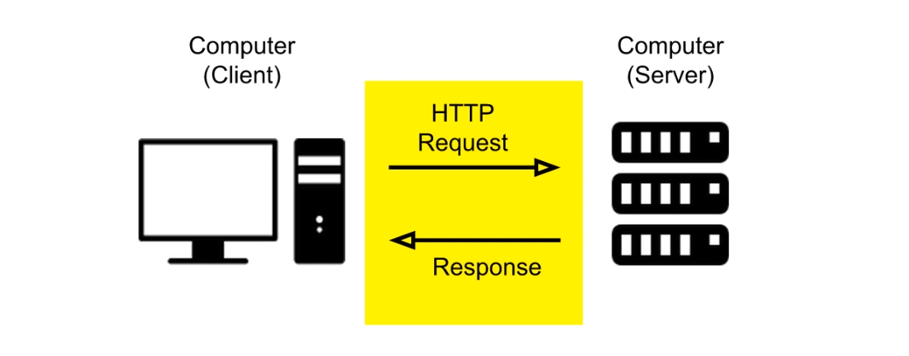

# 브라우저 환경에서의 JavaScript

* 본디 웹페이지에 보조적인 기능을 수행하기 위해 탄생한 프로그래밍 언어
* 브라우저 환경 제어를 위해 호스트 객체 를 제공한다.


## 호스트 객체

호스트 객체(Host object)는 브라우저 환경에서 호스트 환경에 정의된 객체를 말한다.\
호스트 객체는 DOM 과 BOM 으로 분리될 수 있다.

* 문서 객체 모델(Document Object Model) :
  자바스크립트를 통해 동적으로 문서를 변경할 수 있게하는 인터페이스
* 브라우저 객체 모델(Browser Object Model) :
  브라우저 창에 접근하고 조작할 수 있게 하는 인터페이스 (공식명칭은 아님)

## Document Object Model

Javascript 가 어떻게 확장자가 다른 HTML 문서의 내용을 동적으로 수정할 수 있을까?\
텍스트 파일로 이루어진 문서를 브라우저가 이해할 수 있는 구조로 재구성 하는 과정이 있기 때문이다.\
이러한 재구성을 거친 결과물이 DOM 이다.

* 트리구조로 문서의 구조화된 표현을 제공
* 이를 제어할 수 있는 DOM API 를 제공

### DOM Tree

HTML 문서를 브라우저 렌더링 엔진이 파싱하여 DOM Tree 를 생성한다.

```html

<html lang="en">
<head>
	<title>My first web page</title>
</head>
<body>
<h1 id="hello">Hello, world!</h1>
<p>How are you?</p>
</body>
</html>
```

위 문서는 다음과 같이 DOM Tree 로 변환된다.


h1 에 접근하고자 할 경우 `Element.children` API 를 통해 다음과 같이 자식 요소들의 순서에 따라 headline 요소에 접근할 수 있다.

```js
document.children[0].children[1].children[0] // <h1>Hello, world!</h1>
```

### DOM 의 노드 타입

DOM 을 구성하는 대표적인 노드 타입은 다음과 같다.

#### 문서 노드 (Document Node)

```js
document // #document
document.nodeType === Node.DOCUMENT_NODE // true
```

* DOM Tree 의 최상위에 존재하는 유일한 루트 요소 이다.
* DOM Tree 내의 하위 요소들에 접근하기 위한 진입점 역할을 한다.

#### 요소 노드 (Element Node)

```js
document.body // <body>..</body>
document.body.nodeType === Node.ELEMENT_NODE //true

// 부모 요소에 접근
document.body.parentElement // <html>..</html>

// 자식 요소에 접근
document.body.children // HTMLCollection [..]
```

* HTML 요소를 가리키는 객체이다.
* 요소 간의 부모, 자식 관계를 가진다. 이러한 계층 구조를 통해 문서의 구조를 표현한다.

#### 속성 노드 (Attribute node)

```js
document.body.attributes // NamedNodeMap
document.body.attributes[0].nodeType === Node.ATTRIBUTE_NODE // true

document.body.id = 'html-body'
document.body.attributes.id // id="html-body"
```

* 요소 노드의 속성을 가리키는 객체이다.
* 속성을 변경하려면 속성 노드의 부모 노드인 요소 노드를 통해 접근하여야 한다.

#### 텍스트 노드 (Text Node)

```js
document.querySelector('h1').childNodes[0] // text
document.querySelector('h1').childNodes[0].nodeType === Node.TEXT_NODE

document.querySelector('h1').textContent // "Hello, World!"
```

* 요소 노드의 텍스트를 가르키는 객체이다.
* 텍스트를 변경하려면 텍스트 노드의 부모 노드인 요소 노드를 통해 접근하여야 한다.
* 자식 노드를 가질 수 없는 Leaf Node 이다.

### 요소 (Element Node) 취득

요소를 읽거나, 수정하기 위해서는 먼저 요소를 취득할 필요가 있다.
가령 아이디 속성을 가진 요소를 취득하고자 한다면 `document.getElementById` 메서드를 사용할 수 있다.

```js
document.getElementById('hello') // <h1 id="hello">Hello, world!</h1>
```

### 요소 생성

```js
const h2Element = document.createElement('h2');
h2Element.textContent = 'hello, DOM!'  
```

### 생성된 요소를 문서내에 추가하기

`Element.prepend`, `Element.append` 등 DOM API 를 이용하여 생성된 요소를 삽입할 수 있다.

```js
document.body.append(h2Element)
```

### 이벤트 타겟 (EventTarget)

이벤트(event) 는 무언가 일어났다는 신호이다.\
이벤트 타겟은 이러한 이벤트의 발생을 감지할 수 있는 인터페이스이다.\
DOM 의 노드들은 `EventTarget` 인터페이스를 지니고 있다.

```js
document instanceof EventTarget // true
document.body instanceof EventTarget // true 
```

EventTarget 의 인터페이스는 다음과 같다.

```ts
// lib.dom.d.ts
interface EventTarget {
	addEventListener(type: string, callback: EventListenerOrEventListenerObject | null, options?: AddEventListenerOptions | boolean): void;

	dispatchEvent(event: Event): boolean;

	removeEventListener(type: string, callback: EventListenerOrEventListenerObject | null, options?: EventListenerOptions | boolean): void;
}
```

따라서 `HTMLElement.prototype.addEventListener` 를 통해 감지하고 싶은 이벤트를 다음과 같이 할당할 수 있다.

```js
const buttonElement = document.createElement('button')
buttonElement.textContent = 'say hello'

// 이벤트 콜백함수
function handleButtonEvent (event) {
  alert(`hello, ${event.type} event!`)
}

// 이벤트 할당
buttonElement.addEventListener('click', handleButtonEvent)
buttonElement.addEventListener('mouseover', handleButtonEvent)

document.body.prepend(buttonElement)
```

## Ajax

Asynchronous JavaScript and XML.

비동기 방식으로 서버에 데이터를 요청하고 수신하는 방식을 일컫는다.



### 비동기 처리

서버와의 네트워크 통신은 요청을 보내고, 요청을 기다림에 까지 일정한 시간 간극이 소요된다.
요청을 보내고 요청이 이행되면 데이터를 처리할 수 있는 비동기 처리 방식이 필요하다.

#### Promise

Promise 는 성공, 실패, 대기 의 상태를 가지는 일련의 비동기를 제어하기위한 규칙이다.

* 대기(pending): 이행하지도, 거부하지도 않은 초기 상태.
* 이행(fulfilled): 연산이 성공적으로 완료됨.
* 거부(rejected): 연산이 실패함.

약 1 초 후 `'done'`이라는 약속을 반환하는 간단한 프라미스를 리턴하는 함수를 만들어보자.

```js
function getPromise () {
  return new Promise(function (resolve, reject) {
    setTimeout(function () {
      resolve('done')
    }, 1000)
  })
}
```

반환받은 프라미스를 출력하여보면 대기(pending) 상태에 놓여있음을 확인할 수 있다.

```js
const promise = getPromise()
console.log(promise) // Promise {<pending>}
```

#### 이행/거부 처리

`Promise.prototype.then` 을 통해 약속이 이행된 이후의 동작을 정의할 수 있다.

```js
getPromise().
  then(function loggingData (data) {
    console.log(data) // 'done'
  })
```

`Promise.prototype.catch` 을 통해 약속이 거부된 이후의 동작을 정의할 수 있다.

```js
getPromise().
  catch(function loggingError (error) {
    console.error(error) // Error: fail
  })
```

### fetch API

fetch 는 프라미스를 반환하는 네트워크 요청을 위한 Web API 이다.

다음과 같이 URL 과 요청 method 를 지정하여 httpRequest 요청을 담은 프라미스를 반환할 수 있다.

```js
const REQUEST_URL = 'http://jsonplaceholder.typicode.com'

const promise = fetch(REQUEST_URL + '/todos', {
  method: 'GET'
})
console.log(promise) // Promise {<pending>}
```

promise 를 이행/거부 처리를 함으로 요청에 대한 결과를 수신할 수 있다.

```js
fetch(REQUEST_URL + '/todos', {
  method: 'GET'
}).
  then(response => response.json()).
  then(console.log)
```

fetch 를 사용함에 유의할 점은 네트워크 오류로 인해 요청이 미수신 되지 않는한

400, 500 번대 서버 응답이 오더라도 거부 처리되지않고 그대로 이행된다는 점이다.

```js
fetch(REQUEST_URL + '/todos/unknown', { // 의도적으로 유효하지 않은 주소로 요청을 보냄
  method: 'GET'
}).
  then(response => console.log('fulfilled : %s', response.status)) // fulfilled : 404
```

#### fetch API 의 요청 거부 처리

catch 를 통해 400, 500 번대 서버 응답을 거부로 판단하고 처리하고자 한다면
`response.ok` 를 통하여 이를 간단하게 달성할 수 있다.

```js
fetch(REQUEST_URL + '/todos/unknown', { // 의도적으로 유효하지 않은 주소로 요청을 보냄
  method: 'GET'
}).
  then(response => {
    if (!response.ok) {
      // response.ok 가 아닌 경우 에러를 던진다.
      throw new Error(response.status + '. ' + response.statusText)
    }
    return response
  }).
  catch(error => {
    alert(error.message) // alert : 404. Not Found
  })
```