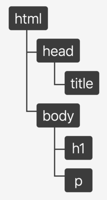

# 브라우저 환경에서의 JavaScript

* 본디 웹페이지에 보조적인 기능을 수행하기 위해 탄생한 프로그래밍 언어
* 브라우저 환경 제어를 위해 호스트 객체 를 제공한다.


## 호스트 객체

호스트 객체(Host object)는 브라우저 환경에서 호스트 환경에 정의된 객체를 말한다.
호스트 객체는 DOM 과 BOM 으로 분리될 수 있다.

* 문서 객체 모델(Document Object Model) :
  자바스크립트를 통해 동적으로 문서를 변경할 수 있게하는 인터페이스
* 브라우저 객체 모델(Browser Object Model) :
  브라우저 창에 접근하고 조작할 수 있게 하는 인터페이스

## Document Object Model

Javascript 가 어떻게 확장자가 다른 HTML 문서의 내용을 동적으로 수정할 수 있을까?
텍스트 파일로 이루어진 문서를 브라우저가 이해할 수 있는 구조로 재구성 하는 과정이 있기 때문이다.
이러한 재구성을 거친 결과물이 DOM 이다.

* 트리구조로 문서의 구조화된 표현을 제공
* 이를 제어할 수 있는 DOM API 를 제공

### DOM Tree

HTML 문서를 브라우저 렌더링 엔진이 파싱하여 DOM Tree 를 생성한다.

```html
<html lang="en">
 <head>
   <title>My first web page</title>
  </head>
 <body>
    <h1 id="hello">Hello, world!</h1>
    <p>How are you?</p>
  </body>
</html>
```

위 문서는 다음과 같이 DOM Tree 로 변환된다.



h1 에 접근하고자 할 경우 `Element.children` API 를 통해 다음과 같이 접근할 수 있다.

```js
document.children[0].children[1].children[0] // <h1>Hello, world!</h1>
```

### DOM 의 노드 타입

DOM 을 구성하는 대표적인 노드 타입은 다음과 같다.

#### 문서 노드 (Document Node)

```js
document // #document
document.nodeType === Node.DOCUMENT_NODE // true
```


* DOM Tree 의 최상위에 존재하는 유일한 루트 요소 이다.
* DOM Tree 내의 하위 요소들에 접근하기 위한 진입점 역할을 한다.

#### 요소 노드 (Element Node)

```js
document.body // <body>..</body>
document.body.nodeType === Node.ELEMENT_NODE //true

// 부모 요소에 접근
document.body.parentElement // <html>..</html>

// 자식 요소에 접근
document.body.children // HTMLCollection [..]
```

* HTML 요소를 가리키는 객체이다.
* 요소 간의 부모, 자식 관계를 가진다. 이러한 계층 구조를 통해 문서의 구조를 표현한다.

#### 속성 노드 (Attribute node)

```js
document.body.attributes // NamedNodeMap
document.body.attributes[0].nodeType === Node.ATTRIBUTE_NODE // true

document.body.id = 'html-body'
document.body.attributes.id // id="html-body"
```

* 요소 노드의 속성을 가리키는 객체이다. 
* 속성을 변경하려면 속성 노드의 부모 노드인 요소 노드를 통해 접근하여야 한다.

#### 텍스트 노드 (Text Node)

```js
document.querySelector('h1').childNodes[0] // text
document.querySelector('h1').childNodes[0].nodeType === Node.TEXT_NODE

document.querySelector('h1').textContent // "Hello, World!"
```

* 요소 노드의 텍스트를 가르키는 객체이다.
* 텍스트를 변경하려면 텍스트 노드의 부모 노드인 요소 노드를 통해 접근하여야 한다.
* 자식 노드를 가질 수 없는 Leaf Node 이다.

### 요소 (Element Node) 취득


### Element Node 내의 하위 Node 취득

### Element 생성

### 생성된 Element 문서내에 추가하기

### 이벤트 리스너

### 동적인 문서 제어 : input - click - append

## Browser Object Model

## Ajax